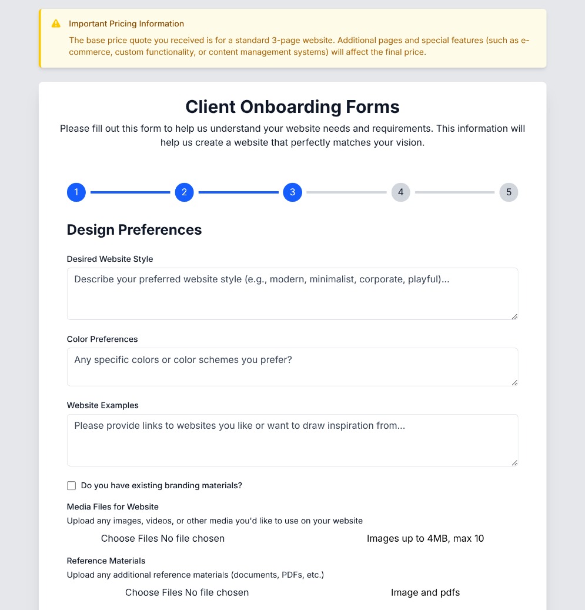

#  Client Onboarding Forms

> 🚀 A sleek, modern client onboarding system built with Next.js 13, React, and TypeScript. Stop the back-and-forth emails - get all the project details you need in one go!

[](https://nextjs.org)
[](https://www.typescriptlang.org)
[](https://tailwindcss.com)

<div align="center">
  
</div>

## ✨ Features

🎯 **Smart Multi-Step Form**
- Intuitive progress tracking
- Save and resume functionality
- Responsive design that works everywhere

📁 **File Management**
- Drag-and-drop file uploads
- Support for images, PDFs, and docs
- Automatic file hosting with Uploadthing

📧 **Automated Communications**
- Instant email notifications
- Beautifully formatted submissions
- Gmail integration

🎨 **Modern UI/UX**
- Clean, professional design
- Smooth transitions
- Dark mode support
- Accessible components

## 🚀 Live Demo

Check out the live demo at [your-demo-url.vercel.app](https://your-demo-url.vercel.app)

## 🛠️ Tech Stack

- **Framework:** Next.js 13 with App Router
- **Language:** TypeScript
- **Styling:** Tailwind CSS
- **Email Service:** Nodemailer with Gmail
- **File Storage:** Uploadthing
- **Deployment:** Vercel

## 💻 Quick Start

1. **Clone and install:**
   ```bash
   git clone https://github.com/yourusername/client-onboarding.git
   cd client-onboarding
   npm install
   ```

2. **Set up your environment:**
   ```bash
   cp .env.example .env
   ```
   Fill in your environment variables:
   ```env
   EMAIL_USER=your-email@gmail.com
   EMAIL_PASSWORD=your-app-specific-password
   ...
   ```

3. **Start developing:**
   ```bash
   npm run dev
   ```

   Open [http://localhost:3000](http://localhost:3000) 🚀

## 📦 Project Structure

```
src/
├── app/                # Next.js 13 App Router
│   ├── components/     # React Components
│   ├── api/           # API Routes
│   └── types/         # TypeScript Types
├── public/            # Static Assets
└── styles/           # Global Styles
```

## 🌟 Key Features Explained

### 🔄 Multi-Step Form
The form is broken down into logical sections:
- Basic Information
- Project Goals
- Design Preferences
- Technical Requirements
- Timeline & Budget

### 📤 File Uploads
- Secure file uploads via Uploadthing
- Support for multiple file types
- Automatic file optimization

### 📨 Email Notifications
- Instant notifications when clients submit forms
- Professionally formatted emails
- Easy to customize templates

## 🚀 Deployment

### Deploy to Vercel

[](https://vercel.com/new/clone?repository-url=https%3A%2F%2Fgithub.com%2Fyourusername%2Fclient-onboarding)

1. Push your code to GitHub
2. Import to Vercel
3. Add your environment variables
4. Deploy! 🚀

## ✨ Customization

### Adding New Fields
```typescript
// src/app/types/form.ts
interface ClientFormData {
  // Add your custom fields here
  newField: string;
}
```

### Styling
Customize the look in `tailwind.config.js`:
```javascript
module.exports = {
  theme: {
    extend: {
      // Add your custom styles
    }
  }
}
```

## 📝 License

This project is open source and available under the [MIT License](LICENSE).

## 💪 Contributing

Contributions are what make the open source community such an amazing place to learn, inspire, and create. Any contributions you make are **greatly appreciated**.

1. Fork the Project
2. Create your Feature Branch (`git checkout -b feature/AmazingFeature`)
3. Commit your Changes (`git commit -m 'Add some AmazingFeature'`)
4. Push to the Branch (`git push origin feature/AmazingFeature`)
5. Open a Pull Request

## 🙌 Support

Give a ⭐️ if this project helped you!
